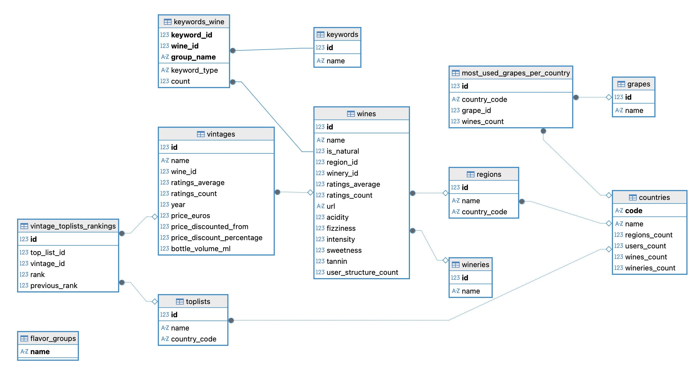

### A wine market analysis project to consolidate SQL

- Duration of the project: `5 days`
- When: `March 2026` 
- Where: `Becode` 

#### This report presents the findings of an analysis of the Vivino db.

#### Schema

### The mission
1. Highlight 10 wines to increase sales
2. Marketing budget allocation: 5 markets in expansion to focus on with high engagement index
3. Give 3 different awards to the best wineries: best winery rated by consumers, winery with best wine rating, winery with best value for money wine
4. Get 5 best-rated wines for 3 most common used grapes
5. Get leaderboard of 10 countries with best average wine rating
6. Get leaderboard of 5 countries with best average vintages rating 
7. Promote 10 wines best-value for money ratings_average > 4.5 AND price < 50
8. Find wines matching tastes with all 5 keywords: coffee, citrus, cream, green apple, toast

### Report
**1. Highlight 10 wines for promotion to increase sales:** 

A list of 10 excellent wines to promote with high rating > 4.5 and less known to the public less users rating < 1000

| Name | Country | Avg Rating | Avg Price |
|------|---------|------------|-----------|
| Book 17 XVII | South Africa | 4.7 | 242.75 |
| Vin Santo di Montepulciano | Italy | 4.6 | 315.89 |
| De Buris Amarone della Valpolicella Classico Riserva | Italy | 4.7 | 448.75 |
| Finca Garbet | Spain | 4.6 | 168.00 |
| Eszencia | Hungary | 4.7 | 480.37 |
| The Black Lion | South Africa | 4.7 | 242.75 |
| Cabernet Sauvignon Coeur De Vallée | USA | 4.6 | 295.00 |
| Ampio | Italy | 4.6 | 331.25 |
| Tordiz 40 Year Old Tawny Port | Portugal | 4.6 | 337.50 |
| L'Extravagant de Doisy-Daëne Sauternes | France | 4.6 | 320.60 |

**2. Marketing budget allocation: 5 markets in expansion to focus on with high engagement index**

Find 5 markets in expansion to focus on for marketing. I excluded USA as it is already a large market with many active users.

The engagement index reflects the overall activity and interaction of users within each country's wine community.

| Country | Users Count | Wines Count | Wineries Count | Engagement Index |
|-----------|------------|------------|---------------|-----------------|
| Switzerland | 1,601,799 | 33,656 | 3,849 | 47.59 |
| Romania | 228,185 | 6,841 | 686 | 33.36 |
| Portugal | 1,123,535 | 39,847 | 5,834 | 28.20 |
| Israel | 150,549 | 5,435 | 529 | 27.70 |
| Spain | 2,264,396 | 102,662 | 18,026 | 22.05

**3. Give 3 different awards to the best wineries: best winery rated by consumers, winery with best wine rating, winery with best value for money wine**

